

<h1>🤝 TrustChains — Decentralized Trust Economy</h1>

**A premium, web3-powered peer-to-peer micro-lending ecosystem bridging the gap between borrowers and lenders through AI identity verification, on-chain trust scores, and secure smart contracts.**

---

---

## 🌟 Overview

TrustChains is a state-of-the-art decentralized lending platform designed to unify the peer-to-peer financial journey. By connecting Borrowers, Lenders, and Community Governors into a single, cohesive ecosystem, TrustChains removes banking intermediaries and empowers users with real-time on-chain trust scoring, AI-driven identity verification, and immutable smart contract execution.

---

## 🎭 Role-Based Access

TrustChains provides custom-tailored environments for key participants in the decentralized economy:

| 🧑‍💻 Borrower Portal | 🏦 Lender Dashboard | ⚖️ Community Governance |
| :--- | :--- | :--- |
| • Secure KYC & identity verification • Real-time on-chain Trust Score building • Request decentralized micro-loans • Track EMIs and scheduled repayments | • Portfolio & investment analytics • Filter high-trust borrower requests • Fund loans securely via smart contracts • Track financial returns and active assets | • Vouch for trusted community members • Vote to approve borderline loan requests • Flag and penalize fraudulent actors |

---

## 🧑‍💻 Borrower Experience

### 🔐 Secure Authentication
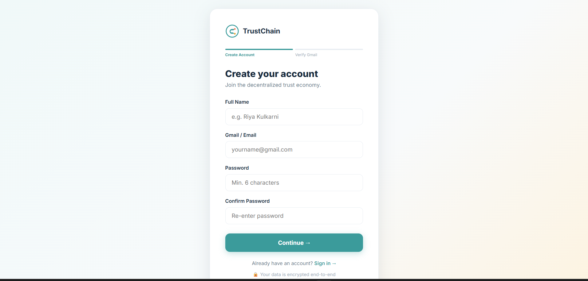
TrustChains features an advanced authentication system backed by Supabase. During onboarding, borrowers set up their profiles and begin their journey toward building a decentralized financial identity.

---

### 🪪 KYC AI-Powered Face Verification
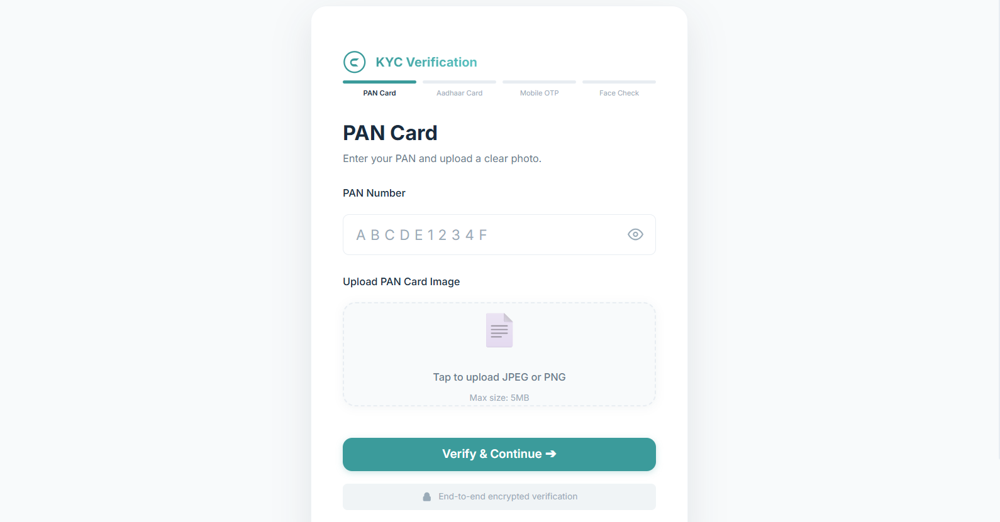
A crucial step in establishing trust. Using advanced `face-api.js` models, the system ensures real-time liveness detection and matches the user's physical presence, preventing bot accounts and sybil attacks.

---

### 📄 Document OCR Validation
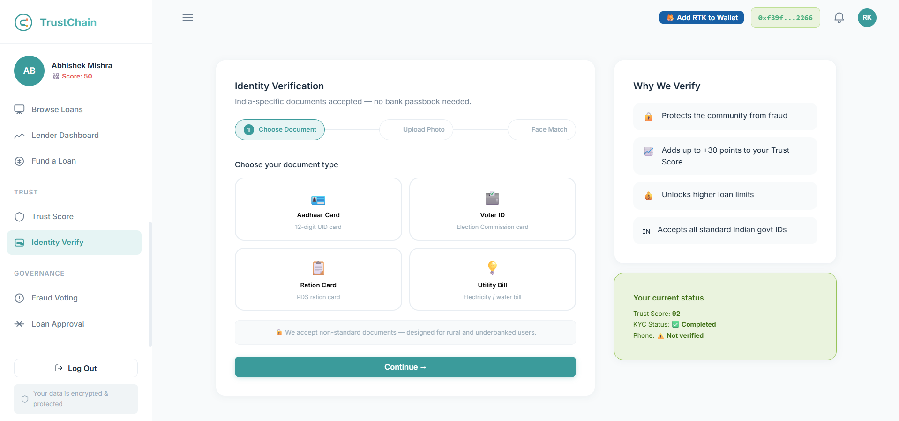
Seamless extraction and validation of Aadhaar and PAN documents using Optical Character Recognition (OCR) via Tesseract.js, ensuring legal compliance without manual intervention.

---

### 🦊 Web3 Wallet Integration
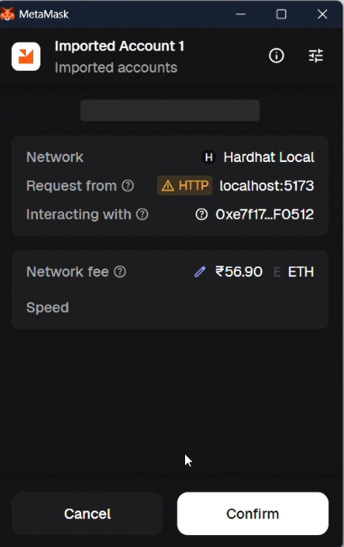
A secure bridge to the blockchain. Users connect their MetaMask wallet to cryptographically sign loan agreements, receive funds, and execute repayments directly on the Ethereum network.

---

### 📊 Borrower Command Dashboard
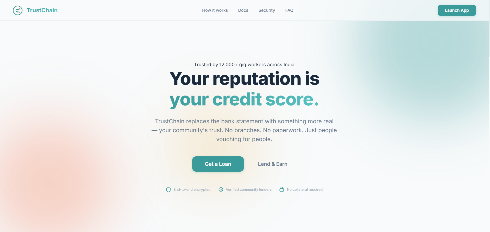
The borrower’s central hub, displaying live on-chain Trust Scores, active loan statuses, pending repayments, and recent community activity in a unified, beautifully designed interface.

---

### 👤 On-Chain Trust Profile
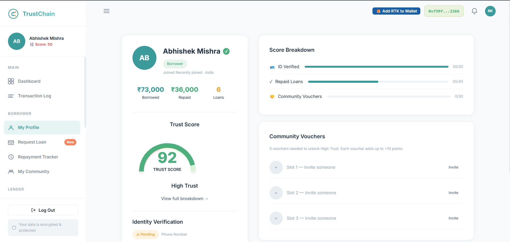
A detailed breakdown of a user's Trust Score factors. Borrowers can track their progress across KYC verification points, historical repayment streaks, and the strength of their community endorsements.

---

### 💸 Request Decentralized Loans
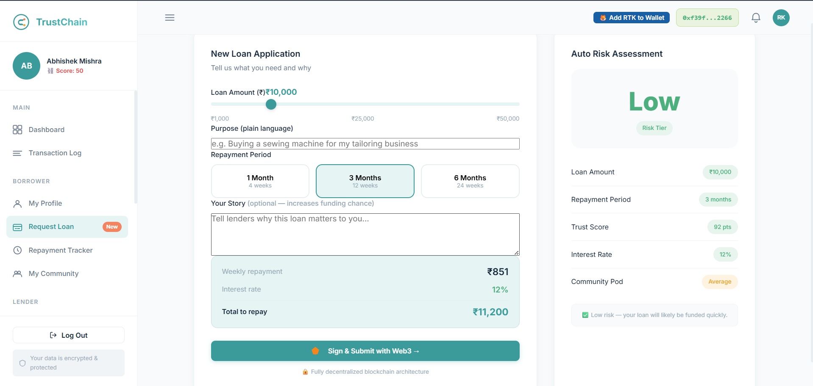
A streamlined application engine enabling borrowers to request micro-loans. Users specify their required principal and purpose, while the system dynamically determines their eligible interest rate based on their active Trust Tier.

---

### 📅 EMI & Repayment Tracker
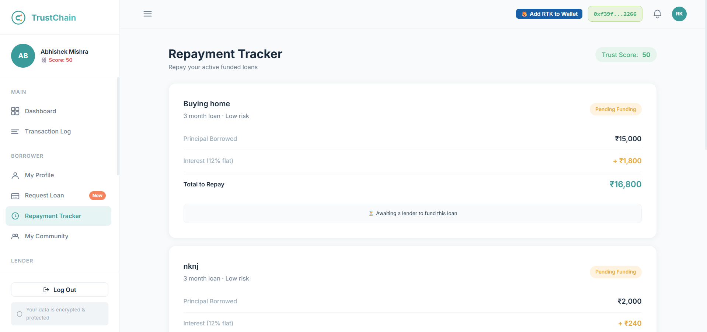
A visual scheduling tool for borrowers to track upcoming EMI dates, view their remaining balance, and execute on-time repayments directly to the smart contract to boost their Trust Score.

---

## 🏦 Lender Suite

### 📈 Lender Operations Dashboard
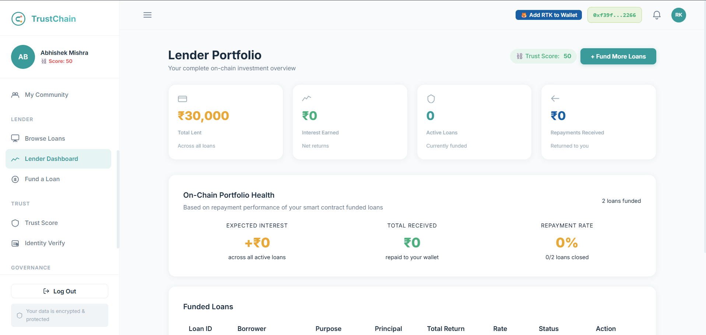
A high-level operations panel built for lenders to monitor their active investments, view overall capital deployed, and track generated interest returns across their decentralized portfolio.

---

### 🔍 Browse & Filter Marketplace
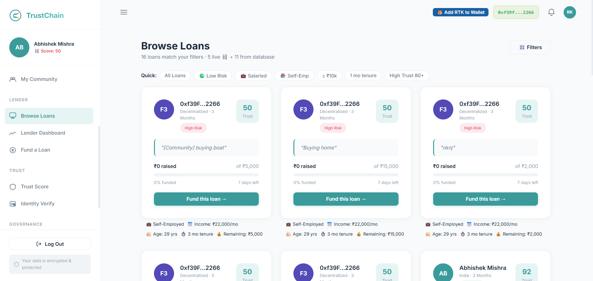
An intuitive discovery marketplace where lenders can browse active loan requests. The system allows sorting by Trust Score, requested amount, and community backing to ensure safe capital allocation.

---

### 💰 Secure Smart Contract Funding
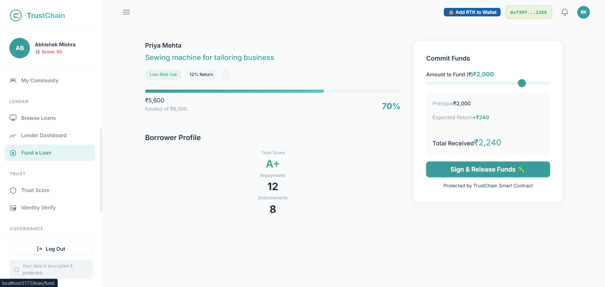
The execution interface where lenders review loan agreements, digitally countersign, and seamlessly release funds. The capital is locked and transferred autonomously via the TrustChain Solidity smart contract.

---

## ⚖️ Community Governance

### 🤝 Community Pods & Endorsements
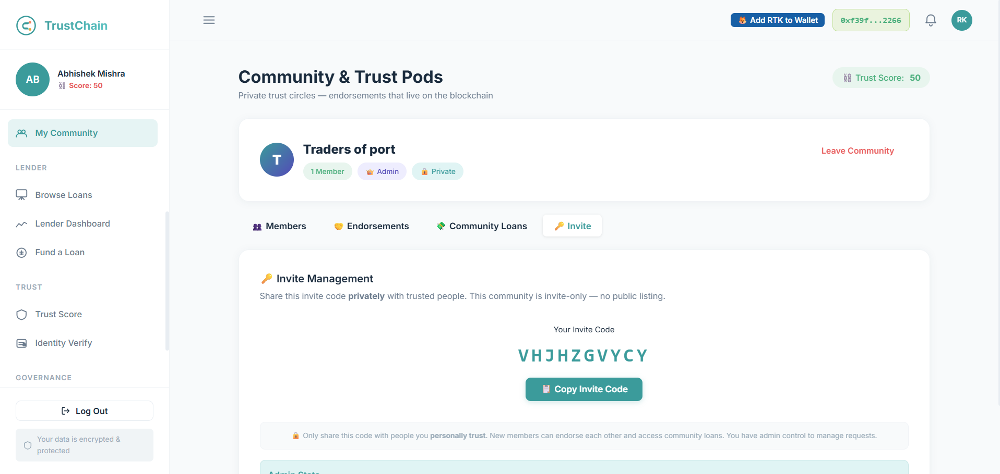
An interactive community network enabling users to form "Trust Pods." Members can vouch for each other, providing social proof that intrinsically boosts the collective Trust Score of the group.

---

### ✅ Decentralized Loan Approval
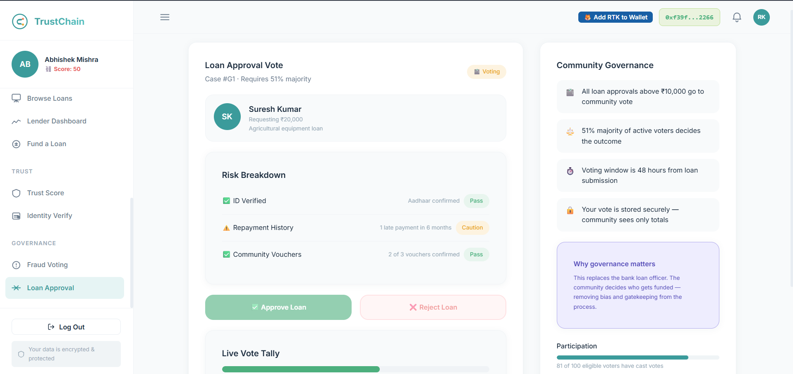
A democratic voting system where community members review and approve borderline or high-value loan requests, ensuring that risky loans are vetted by trusted peers before funding.

---

### 🚨 Fraud Prevention Voting
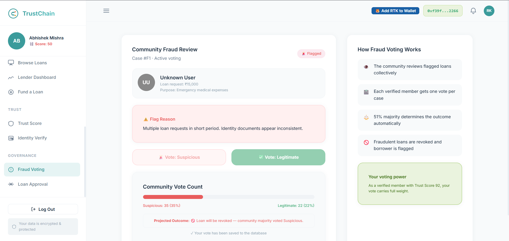
A decentralized security mechanism. The community can flag, review, and vote to penalize suspicious actors or defaulters, permanently lowering their on-chain Trust Score and protecting lenders.

---

### 📜 Immutable Transaction Ledger
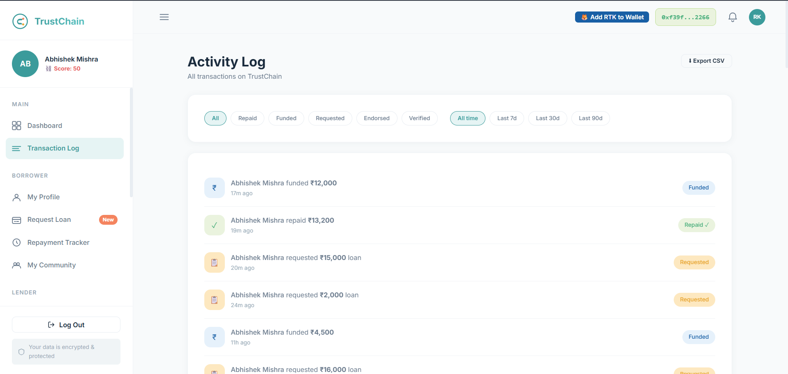
A transparent, immutable history of all platform activity, including loan disbursements, repayments, and governance votes, securely anchored to the blockchain.

---

## 🛠️ Tech Stack & Architecture

### 💻 Frontend

* **Architecture**: Blazing fast Single Page Application (SPA) built with Vite and React 19.
* **Web3 Integration**: Ethers.js for seamless interaction with Ethereum smart contracts and MetaMask.
* **Design Language**: Modern UI/UX utilizing Tailwind CSS utility classes and custom animations.

---

### ⚙️ Backend, Storage & AI

* **Database & Auth**: Supabase PostgreSQL database for off-chain metadata, user profiles, and secure JWT authentication.
* **Identity Verification**: On-device AI processing using `face-api.js` for liveness detection and `Tesseract.js` for document OCR.

---

### ⛓️ Blockchain & Smart Contracts

* **Smart Contracts**: Secure Solidity contracts utilizing OpenZeppelin libraries for loan origination, fund escrow, and repayment logic.
* **Networks**: Configured for local Ethereum testing (Hardhat Node) with deployment pipelines ready for Sepolia Testnet.
* **Development Environment**: Hardhat for local blockchain testing, contract compilation, and deployment pipelines.

---

  Developed with ❤️ for TrustChains. All screenshots are authentic and captured directly from the live platform.

